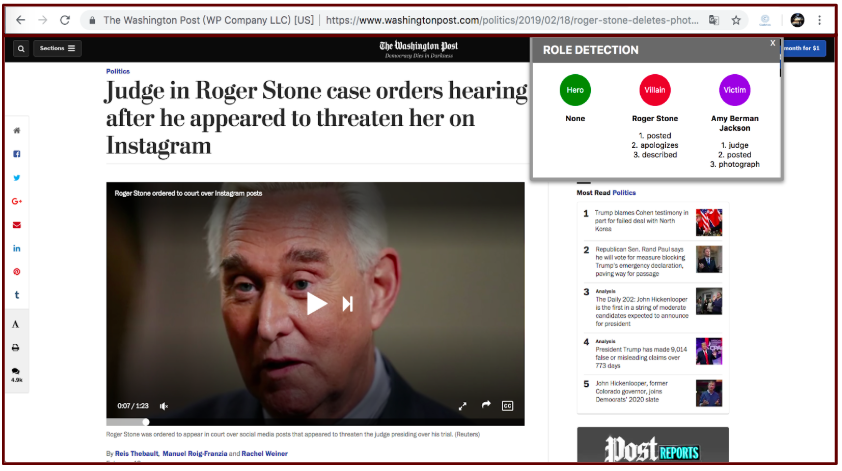

# Hero-Villain-Victim
Deliver a Google Chrome Extension that analyzes the entities (individuals, organizations, countries, etc.) contained within a news article and categorizes the most important entities as either being a hero, villain, or victim.

## Getting Started

### Requirements
#### Newspaper
```
pip3 install newspaper3k
```
#### NLTK

Mac/Unix Enviornment:
```
pip3 install nltk

python3 -m nltk.downloader punkt averaged_perceptron_tagger maxent_ne_chunker words wordnet
```
Windows: http://pypi.python.org/pypi/nltk

#### TextBlob
```
pip3 install textblob
```
#### Spacy
```
pip3 install spacy
python3 -m spacy download xx
```
#### Flask
```
pip3 install flask
```
### Loading Extension
Open the Extension Management page by navigating to chrome://extensions.

Click the LOAD UNPACKED button and select the extension directory.

### To Run
```
python3 flask_app.py
```
Open the a news website on Google Chrome and click the extension icon next to right of the address bar.

## Built With
* [Newspaper](https://github.com/codelucas/newspaper) - scrape articles from news sites
* [NLTK](https://www.nltk.org/) - recognize entities and compute word similarity
* [TextBlob](https://textblob.readthedocs.io/en/dev/) - analyze sentiment of words
* [Spacy](https://spacy.io/) - recognize active/passive sentences
* [Flask](http://flask.pocoo.org/) - host a local server to run code

## User Interface Demo


## Authors:
* **Tianna Avery** - [tiannaavery](https://github.com/tiannaavery)
* **Quinn Mayville** - [mayvilleq](https://github.com/mayvilleq)
* **Yingying Wang** - [yingyingww](https://github.com/yingyingww)
* **Megan Zhao** - [meganzhao](https://github.com/meganzhao)

## Acknowledgments

* Inspired by the paper: Who is the Hero, the Villain, and the Victim?: Detection of Roles in News Articles using Natural Language Techniques (https://dl.acm.org/citation.cfm?id=3172993)
* Basis of merging algorithm comes from the NU Infolab News Context Project
* Advised by Professor David Musicant of Carleton College
* September 2018 - March 2019
